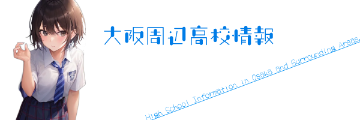
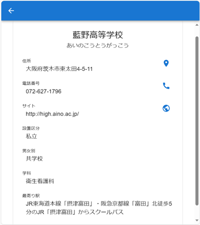

大阪の高等学校すべてと、近隣の私立学校の一部の学校のデータを載せてあります。

作成に当たり、[大阪府教育委員会HP](https://www.pref.osaka.lg.jp/kotogakko/hp/)、[大阪私立中学校高等学校連合会](https://www.osaka-shigaku.gr.jp/school/index.html)のサイトを参考にしました。

## 💻デモ画像

|地図タブ|リストタブ|
|---|---|
|||

|詳細表示|フィルター機能|
|---|---|
|||

## 🌐アプリのURL

<a href="https://drthomas246.github.io/OsakaHightSchool/" style="vertical-align:top">https://drthomas246.github.io/OsakaHightSchool/</a>

## 💬使い方

#### 【地図タブ】
各高校の場所を地図上に表示しています。マウスドラックで移動、マウススクロールで拡大縮小できます。
をクリックするとその学校の【簡易情報】が表示されます。

#### 【リストタブ】
リスト形式で【簡易情報】をを表示します。
【簡易情報】をクリックすると詳細情報を表示します。

#### 【簡易情報】
【簡易情報】には「高校名」「学科」「いくつかのアイコン」が表示されます。アイコンの説明は以下の通りです。

* <svg style="width: 1.2em;" focusable="false" aria-hidden="true" viewBox="0 0 24 24" data-testid="CallIcon"><path d="M20.01 15.38c-1.23 0-2.42-.2-3.53-.56-.35-.12-.74-.03-1.01.24l-1.57 1.97c-2.83-1.35-5.48-3.9-6.89-6.83l1.95-1.66c.27-.28.35-.67.24-1.02-.37-1.11-.56-2.3-.56-3.53 0-.54-.45-.99-.99-.99H4.19C3.65 3 3 3.24 3 3.99 3 13.28 10.73 21 20.01 21c.71 0 .99-.63.99-1.18v-3.45c0-.54-.45-.99-.99-.99z"></path></svg>をクリックすると高校へ電話をかけることができます。
* <svg style="width: 1.2em;" focusable="false" aria-hidden="true" viewBox="0 0 24 24" data-testid="PublicIcon"><path d="M12 2C6.48 2 2 6.48 2 12s4.48 10 10 10 10-4.48 10-10S17.52 2 12 2zm-1 17.93c-3.95-.49-7-3.85-7-7.93 0-.62.08-1.21.21-1.79L9 15v1c0 1.1.9 2 2 2v1.93zm6.9-2.54c-.26-.81-1-1.39-1.9-1.39h-1v-3c0-.55-.45-1-1-1H8v-2h2c.55 0 1-.45 1-1V7h2c1.1 0 2-.9 2-2v-.41c2.93 1.19 5 4.06 5 7.41 0 2.08-.8 3.97-2.1 5.39z"></path></svg>をクリックすると高校のホームページを開くことができます。
* <svg style="width: 1.2em;" focusable="false" aria-hidden="true" viewBox="0 0 24 24" data-testid="RoomIcon"><path d="M12 2C8.13 2 5 5.13 5 9c0 5.25 7 13 7 13s7-7.75 7-13c0-3.87-3.13-7-7-7zm0 9.5c-1.38 0-2.5-1.12-2.5-2.5s1.12-2.5 2.5-2.5 2.5 1.12 2.5 2.5-1.12 2.5-2.5 2.5z"></path></svg>をクリックするとGoogleマップを開くことができます。

#### 【詳細情報】
【簡易情報】をクリックすると詳細情報を表示します。
詳細情報には「高校名」「ふりがな」「住所」「電話番号」「サイト」「設置区分」「男女別」「学科」「最寄り駅」「いくつかのアイコン」が表示されます。アイコンの説明は【簡易情報】と同じです。
左上の<svg style="width: 1.2em;" focusable="false" aria-hidden="true" viewBox="0 0 24 24" data-testid="ArrowBackIcon"><path d="M20 11H7.83l5.59-5.59L12 4l-8 8 8 8 1.41-1.41L7.83 13H20v-2z"></path></svg>をクリックすると元の画面に戻ります。

#### 【学校名検索】
右上の「学校名検索」は検索したい学校名（一部でもよみがなでも可）を入力して検索すると「マップタブ」「リストタブ」それぞれに表示されます。

#### 【フィルター機能】
右上の<svg style="width: 1.2em;" focusable="false" aria-hidden="true" viewBox="0 0 24 24" data-testid="FilterListIcon"><path d="M10 18h4v-2h-4v2zM3 6v2h18V6H3zm3 7h12v-2H6v2z"></path></svg>は高校にフィルターをかけることができます。
「設置区分」「男女校」「学科」別にフィルターをかけることができるので、ほしいフィルターをかけてください。

#### 【設定メニュー】
左上の<svg style="width: 1.2em;" focusable="false" aria-hidden="true" viewBox="0 0 24 24" data-testid="MenuIcon"><path d="M3 18h18v-2H3v2zm0-5h18v-2H3v2zm0-7v2h18V6H3z"></path></svg>をクリックすると設定メニューを表示します。

* 「現在地を表示」をチェックするとマップタグにで現在地を表示します。
* 「使用方法」はこのページを開きます。
* 「利用規約」はこのアプリの利用規約を表示します。
* 「プライバシーポリシー」はこのアプリのプライバシーポリシーを表示します。
* 「バージョン情報」はこのアプリのバージョン情報を表示します。

## 🙍‍♂️著作権

* 作成者: 山原喜寛
* 作成年：2023年8月
* E-mail: [yoshihiro@yamahara.email](mailto:yoshihiro@yamahara.email)
* サイト内の利用規約に違反しない限りご自由にお使いください。
* 掲載情報の間違いを発見された場合は、作成者までご連絡いただけるとありがたいです。