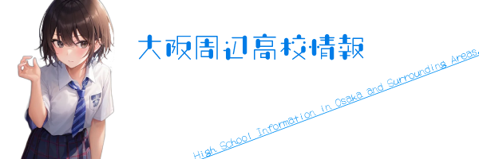
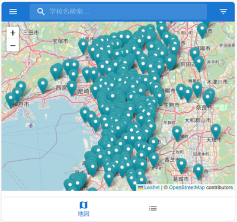
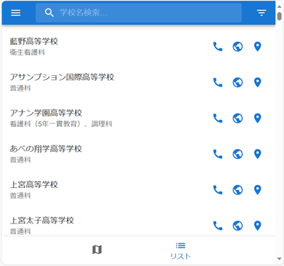
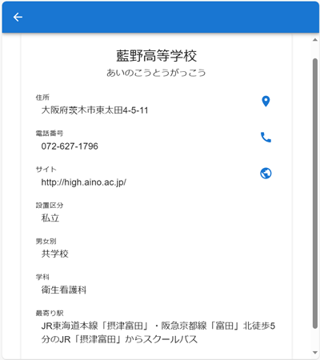
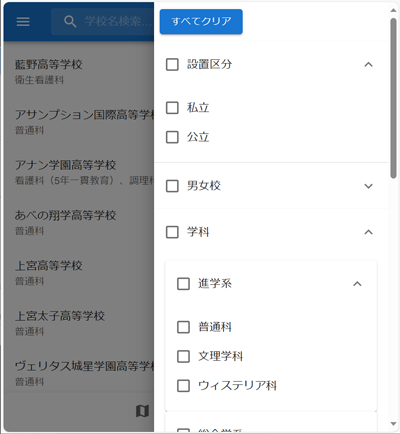

<h2 style="text-align: center;">大阪周辺高校情報</h2>

     


大阪の高等学校すべてと、近隣の私立学校の一部の学校のデータを載せてあります。

作成に当たり、[大阪府教育委員会HP](https://www.pref.osaka.lg.jp/kotogakko/hp/)、[大阪私立中学校高等学校連合会](https://www.osaka-shigaku.gr.jp/school/index.html)のサイトを参考にしました。

### 💻DEMO

|マップ表示|リスト表示|
|---|---|
|||

|詳細表示|フィルター機能|
|---|---|
|||


### 🌐App URL

* [https://www.hobofoto.net/OsakaHightSchool/](https://www.hobofoto.net/OsakaHightSchool/)

### 📦Requirement

* 
* 
* 
* 
* 
* 
* 


### 🔧Development

* 
* 
* 
* ![valtio](https://img.shields.io/badge/valtio-%5E1.11.2-blue.svg?logo=data:image/svg%2bxml;base64,PHN2ZyB4bWxucz0iaHR0cDovL3d3dy53My5vcmcvMjAwMC9zdmciIHhtbDpzcGFjZT0icHJlc2VydmUiIHZpZXdCb3g9IjAgMCAyMTQgMTcyLjUiPgogIDxwYXRoIGQ9Im0yOC41IDEwMy44IDYuNy0yMS42IDMuNi0xMS43Yy41LTEuNyAxLjQtMi41IDMuMi0yLjVoNy41YzEuNyAwIDIuMi42IDEuNiAyLjNhMzE4NC4yIDMxODQuMiAwIDAgMC0xNS45IDQ0LjRjLS41IDEuNi0xLjQgMi4zLTMuMSAyLjJoLTcuN2MtMiAuMS0zLS43LTMuNy0yLjZMNy40IDc2LjcgNSA3MC4xYy0uNy0xLjcgMC0yLjMgMS43LTIuMmg3LjJjMS45LS4xIDIuOC43IDMuNCAyLjVsOC40IDI3LjIgMiA2LjEuOC4xem05Mi4yLTExLjR2LTEyYzAtMy44IDAtMy44LTMuNy0zLjhoLTEuMmwtLjctLjFjLTIuNS0xLjctMS00LjItMS4zLTYuMy0uMi0xLjUuOC0xLjkgMi4yLTIgNC43LS4zIDQuNy0uNCA0LjgtNSAuMS04LTEuMS02LjggNi44LTYuOWgxYzMuNiAwIDMuNy4xIDMuNyAzLjZ2NmMwIDEuNy43IDIuNCAyLjQgMi40aDQuN2MxLjUgMCAyLjMuNiAyLjMgMi4yLjEgNy40LjQgNi4yLTUuNyA2LjMtMy43IDAtMy44LjEtMy44IDMuOHYyMC43YzAgNS40IDEuNyA3LjEgNy4xIDYuOCAxLjMtLjEgMS45LjMgMi4xIDEuNWwuNyAzLjRjLjcgMy43LjQgNC4zLTMuMyA0LjctNS40LjUtMTAuNy4zLTE0LjgtNC4yYTEyLjQgMTIuNCAwIDAgMS0zLjQtOC4zbC4xLTEyLjh6bS05LjktNy42VjExNWMwIDEuNy0uNiAyLTIgMmgtNi41Yy0yLjUuMi0zLjEtLjktMy4xLTMuMlY1NC4xYzAtMS44LjctMi42IDIuNS0yLjZoNmMyLjMtLjEgMy4xLjggMy4xIDN2MzAuM3ptMzUuNCA3LjZjMC03LjIuMS0xNC4zIDAtMjEuNCAwLTIuMS43LTMuMSAyLjktM2g1LjdjMi4xLS4xIDMgLjcgMi45IDIuOXY0Mi45YzAgMi4zLS43IDMuNC0zLjEgMy4yaC01LjVjLTIuMS4xLTMtLjctMi45LTIuOVY5Mi40em01LjktNDMuOGMzLjggMCA2LjYgMi44IDYuNiA2LjMtLjEgMy4yLTMgNi02LjQgNi4xcy02LjktMy4yLTYuOS02LjNjLS4xLTMuNCAzLTYuMSA2LjctNi4xem0tNzAuNCA2MS43Yy0yLjggNC44LTcgNy0xMS45IDcuNC04LjguNy0xNy4yLTIuMi0xOC44LTEyLjdhMTMgMTMgMCAwIDEgNy45LTE0LjNjNS4yLTIuMiAxMC43LTIuMiAxNi4xLTMuMmwyLS4zYzIuMS0uNCA0LjItLjggNC43LTMuNC40LTIuNC0xLjItNS4zLTMuMy02LjUtNC4xLTIuMy05LjgtMS43LTEyLjggMS45LTIuMSAyLjQtNC4yIDMuMy03LjEgMi40LTEtLjMtMi4xLS4zLTMuMi0uNC0yLjYtLjQtMi43LS42LTEuNi0zLjEgMi45LTYuMiA4LjItOS41IDE0LjctMTAuMyA1LjUtLjcgMTEuMS0uNyAxNi40IDEuOSA1LjcgMi44IDguNCA3LjYgOC42IDEzLjYuMyAxMC4zLjEgMjAuNi4xIDMwLjkgMCAyLS43IDIuOS0yLjggMi44aC01LjVjLTIuMS4xLTIuOS0uOC0yLjgtMi44LS4xLTEuMS4xLTIuMy0uNy0zLjl6bTAtMTUuMWMwLS43LS4zLTEuMi0xLjEtMS00LjcgMS4yLTkuNyAxLjMtMTQuNCAzLTIuOSAxLjEtNC4yIDMuNC00IDYuNS4yIDIuNiAxLjYgNC4yIDQuNiA1LjIgNyAyLjQgMTUuOC0yLjkgMTQuOS0xMS40di0yLjN6bTEyNy41LTEuNGEyNS40IDI1LjQgMCAwIDEtNy4zIDE3LjggMjEuNSAyMS41IDAgMCAxLTE3LjMgNi4yYy0xMS4yLS42LTE4LjUtNi4yLTIxLjMtMTcuMS0yLjYtMTAuNC0xLjQtMjAuMiA2LjktMjguMSAzLjItMyA3LTQuNiAxMS4yLTUuMSAxOC41LTIgMjcuNiA5LjcgMjcuOCAyNi4zem0tMTIuMS01Yy0uNy02LjItNC42LTEyLjktMTIuMy0xMi4zLTQuMy40LTggMy4yLTkuNiA4LjJhMjUuNCAyNS40IDAgMCAwIC4xIDE1LjljMS41IDQuNiA1LjMgNy43IDkuNiA3LjggNS4zLjIgOS4xLTIuMiAxMS4xLTcuMmEyMCAyMCAwIDAgMCAxLjItOC43YzAtMS4yLjEtMi41LS4xLTMuN3oiIGNsYXNzPSJzdDAiIGZpbGw9IiNCMkVCRjIiIC8+Cjwvc3ZnPgo=)

### 🔧devDevelopment

* 
* 
* 
* 
* 
* 

### 📥Installation

からクローンしてもらいで必要なパッケージをダウンロードしてください。
```
$ git clone https://github.com/drthomas246/OsakaHightSchool.git
$ yarn install
```

### 💬Usage

* デモ起動は
`$ yarn start`
を実行することででサーバーが起動するので、ブラウザで[http://localhost:3000](http://localhost:3000)にアクセスするとデモを確認できます。（要インターネット）
* ビルドは
`yarn build`
でdistフォルダーに作成されます。
* でのテスティングは
`yarn test`
で行なうことができます。
* でのコンポーネント一覧は
`yarn storybook`
でサーバーが起動し、ブラウザで[http://localhost:6006](http://localhost:6006)にアクセスすると確認できます。

### 🙍‍♂️Author

* 作成者: 山原喜寛
* E-mail: yoshihiro@yamahara.email

- READMEの女の子の絵は[【TRPG沼】無料立ち絵置き場](https://tachie.trpg-start.com/)からお借りしました。


### 🎫License

"大阪周辺高校情報" is under [Business Source License 1.1 modification](./LICENSE.md).